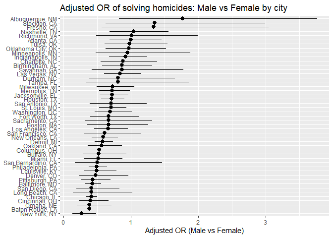
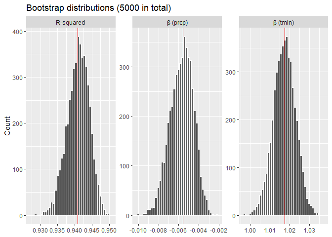

p8105_hw6_yg3096
================

## Problem 1

``` r
# Read data
homi_raw <- readr::read_csv("data/homicide-data.csv", show_col_types = FALSE)

# Clean and process data
homi <- homi_raw %>%
        janitor::clean_names() %>%
        mutate(solved = if_else(disposition == "Closed by arrest", 1L, 0L),
               # Change unknown age into NA
               victim_age = na_if(as.character(victim_age), "Unknown"),
               victim_age = suppressWarnings(as.numeric(victim_age)),
               # White/Black only
               victim_race = case_when(victim_race == "White" ~ "White",
                                       victim_race == "Black" ~ "Black",
                                       TRUE ~ NA_character_),
               victim_sex = factor(victim_sex, levels = c("Female", "Male")),
               victim_race = factor(victim_race, levels = c("White", 
                                                            "Black"))) %>%
        # Filter cities
        filter(!(city == "Dallas" & state == "TX"),
               !(city == "Phoenix" & state == "AZ"),
               !(city == "Kansas City" & state == "MO"),
               !(city == "Tulsa" & state == "AL")) %>%      
        # Filter race
        filter(!is.na(victim_race))

# Data for baltimore
bal_df <- homi %>%
          filter(city == "Baltimore", state == "MD") %>%
          filter(!is.na(victim_age), !is.na(victim_sex), 
                 !is.na(victim_race)) %>%
          droplevels()

# Fit model for baltimore
bal_fit <- glm(solved ~ victim_age + victim_sex + victim_race, data = bal_df, 
               family = binomial())

# Odds ratio
bal_or <- tidy(bal_fit, exponentiate = TRUE, conf.int = TRUE) %>%
          filter(term == "victim_sexMale") %>%
          transmute(city_state = "Baltimore, MD", term, OR = estimate, 
                    CI_low = conf.low, CI_high = conf.high, p = p.value)
bal_or
```

    ## # A tibble: 1 × 6
    ##   city_state    term              OR CI_low CI_high        p
    ##   <chr>         <chr>          <dbl>  <dbl>   <dbl>    <dbl>
    ## 1 Baltimore, MD victim_sexMale 0.426  0.324   0.558 6.26e-10

``` r
# Helper function for glm
glm_function <- function(df) {
                df <- df %>%
                filter(!is.na(victim_age), !is.na(victim_sex), 
                       !is.na(victim_race)) %>%
                droplevels()
                
                if (nrow(df) == 0 || n_distinct(df$victim_sex) < 2 ||
                   n_distinct(df$victim_race) < 2) {
                   return(NULL)
                }

                fit <- glm(solved ~ victim_age + victim_sex + victim_race, 
                           data = df, family = binomial())
                tidy(fit, exponentiate = TRUE, conf.int = TRUE) %>%
                filter(term == "victim_sexMale") %>%
                transmute(OR = estimate, CI_low = conf.low, CI_high = conf.high, 
                          p = p.value)
}

# Fit for all cities
city_or <- homi %>%
           group_by(city, state) %>%
           group_split() %>%
           map_dfr(function(df) {
           this_city <- df$city[1]
           this_state <- df$state[1]
           res <- glm_function(df)
           if (is.null(res) || nrow(res) == 0) {
             tibble(city = this_city, state = this_state,
             OR = NA_real_, CI_low = NA_real_, CI_high = NA_real_, 
             p = NA_real_)
           } else {
             res %>% mutate(city = this_city, state = this_state, .before = 1)
           }
           }) %>%
           filter(!is.na(OR)) %>%
           mutate(city_state = paste(city, state, sep = ", ")) %>%
           arrange(OR)
head(city_or)
```

    ## # A tibble: 6 × 7
    ##   city        state    OR CI_low CI_high        p city_state     
    ##   <chr>       <chr> <dbl>  <dbl>   <dbl>    <dbl> <chr>          
    ## 1 New York    NY    0.262  0.133   0.485 4.54e- 5 New York, NY   
    ## 2 Baton Rouge LA    0.381  0.204   0.684 1.65e- 3 Baton Rouge, LA
    ## 3 Omaha       NE    0.382  0.199   0.711 2.95e- 3 Omaha, NE      
    ## 4 Cincinnati  OH    0.400  0.231   0.667 6.49e- 4 Cincinnati, OH 
    ## 5 Chicago     IL    0.410  0.336   0.501 1.86e-18 Chicago, IL    
    ## 6 Long Beach  CA    0.410  0.143   1.02  7.18e- 2 Long Beach, CA

``` r
# Plot of odds ratio
plot <- city_or %>%
        mutate(city_state = forcats::fct_reorder(city_state, OR)) %>%
        ggplot(aes(x = city_state, y = OR)) +
        geom_pointrange(aes(ymin = CI_low, ymax = CI_high)) +
        coord_flip() + 
        labs(title = "Adjusted OR of solving homicides: Male vs Female by city",
             x = NULL, y = "Adjusted OR (Male vs Female)") 
plot
```

<!-- -->

Across cities, the majority of 95% CIs covers 1, and about 20 cities sit
below 1  
(male-victim cases less likely to be solved). This heterogeneity between
cities  
suggests local context likely matter more than victim sex. Overall, the
plot  
provides little consistent evidence that homicides with male victim are
resolved  
at markedly different rates than those with female victim, however, in
some  
cities (such as New York and Chicago) male-victim cases are actually
less likely  
to be solved.

## Problem 2

``` r
# Filter data
data <- weather_df %>%
        drop_na(tmax, tmin, prcp)
nrow(data)
```

    ## [1] 2171

``` r
# Fit model
fit_full <- lm(tmax ~ tmin + prcp, data = data)
full_r2 <- glance(fit_full)$r.squared
full_tmin <- tidy(fit_full) %>% 
             filter(term == "tmin") %>% 
             pull(estimate)
full_prcp <- tidy(fit_full) %>% 
             filter(term == "prcp") %>% 
             pull(estimate)
est_full <- tibble(param = c("r2", "beta_tmin", "beta_prcp"),
                   est = c(full_r2, full_tmin, full_prcp))

# Helper function
boot_once <- function(df) {
             idx <- sample.int(nrow(df), nrow(df), replace = TRUE)
             dfb <- df[idx, , drop = FALSE]
             fit <- lm(tmax ~ tmin + prcp, data = dfb)
             tibble(r2 = glance(fit)$r.squared,
                    beta_tmin = tidy(fit) %>% 
                    filter(term == "tmin") %>% 
                    pull(estimate), beta_prcp  = tidy(fit) %>% 
                    filter(term == "prcp") %>% 
                    pull(estimate))
}

loop <- 5000
result <- vector("list", loop)
for (i in seq_len(loop)) {
  result[[i]] <- boot_once(data)
}

# Bootstrap
boot <- bind_rows(result)
dim(boot)
```

    ## [1] 5000    3

``` r
head(boot)
```

    ## # A tibble: 6 × 3
    ##      r2 beta_tmin beta_prcp
    ##   <dbl>     <dbl>     <dbl>
    ## 1 0.936      1.00  -0.00636
    ## 2 0.939      1.02  -0.00469
    ## 3 0.943      1.02  -0.00642
    ## 4 0.946      1.03  -0.00523
    ## 5 0.941      1.02  -0.00718
    ## 6 0.941      1.01  -0.00714

``` r
# Confidence interval
ci_r2 <- quantile(boot$r2, c(0.025, 0.975), na.rm = TRUE)
ci_tmin <- quantile(boot$beta_tmin, c(0.025, 0.975), na.rm = TRUE)
ci_prcp <- quantile(boot$beta_prcp, c(0.025, 0.975), na.rm = TRUE)
ci_tbl <- tibble(param = c("r2", "beta_tmin", "beta_prcp"),
                 q2.5 = c(ci_r2[1], ci_tmin[1], ci_prcp[1]),
                 q97.5 = c(ci_r2[2], ci_tmin[2], ci_prcp[2]))
ci_tbl
```

    ## # A tibble: 3 × 3
    ##   param         q2.5    q97.5
    ##   <chr>        <dbl>    <dbl>
    ## 1 r2         0.934    0.947  
    ## 2 beta_tmin  1.01     1.03   
    ## 3 beta_prcp -0.00810 -0.00366

``` r
boot_long <- boot %>%
             pivot_longer(everything(), names_to = "param", 
                          values_to = "value") %>%
             mutate(param = recode(param, r2 = "R-squared", 
                                   beta_tmin = "β (tmin)", 
                                   beta_prcp = "β (prcp)"))
# Estimates
est_full_plot <- est_full %>%
                 mutate(param = recode(param,r2 = "R-squared", 
                                       beta_tmin = "β (tmin)", 
                                       beta_prcp = "β (prcp)"))

# Plot of distribution
ggplot(boot_long, aes(x = value)) + geom_histogram(bins = 40, color = "white") +
geom_vline(data = est_full_plot, aes(xintercept = est), color = "red") + 
facet_wrap(~ param, scales = "free", ncol = 3) + 
labs(title = "Bootstrap distributions (5000 in total)", x = NULL, y = "Count")
```

<!-- -->

Histograms of the 5000 estimates are unimodal and roughly symmetric. R^2
is  
tightly concentrated around about 0.94, indicating good fit. β_1 is
centered a  
little above 1 (about 1.01–1.02), while β_2 is centered near −0.006,
showing  
narrow spreads.

95% bootstrap percentile CIs (2.5%–97.5%) are R^2: \[0.934, 0.946\], β_1
(tmin):  
\[1.006, 1.028\] and β_2 (prcp): \[−0.008, 0.004\].

## Problem 3
